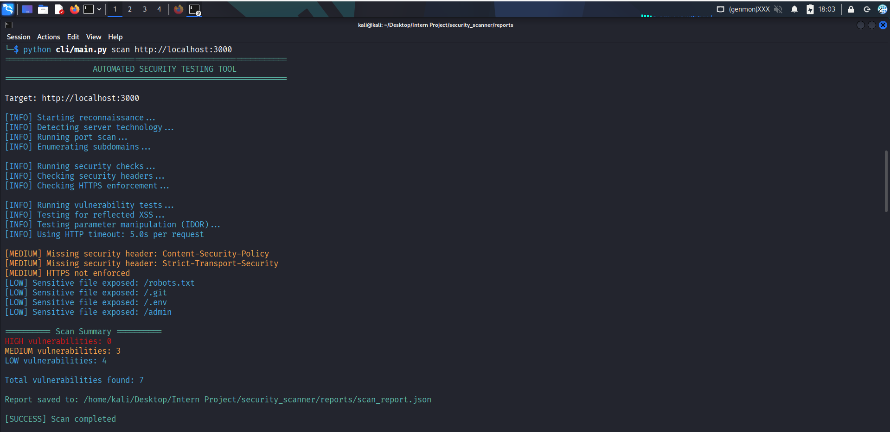
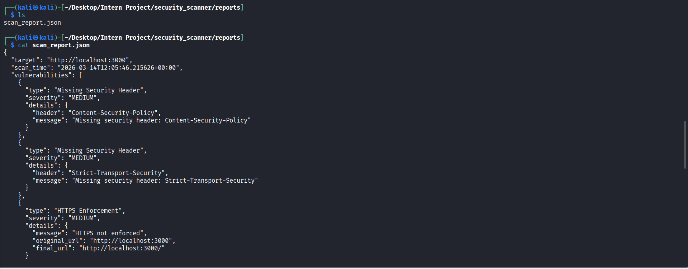
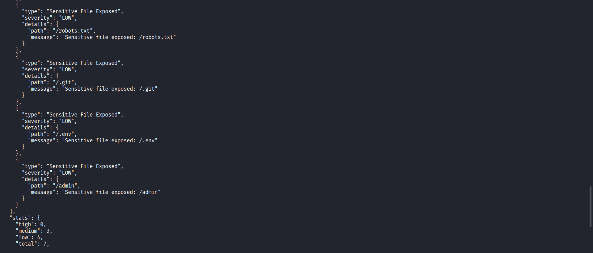

Automated Security Testing Tool
===================================

### Project Overview

Automated Security Testing Software is a Python-based vulnerability scanning tool that performs automated security checks on web applications. The tool identifies common security issues such as missing security headers, open ports, exposed sensitive files, and reflected XSS vulnerabilities. It is designed as a simplified, educational scanner for cybersecurity internship and learning purposes.

The project is intentionally modular:
- **CLI** (`cli/main.py`) handles user interaction, banners, progress, and summary output.
- **Backend scanner engine** (`backend/scanner.py`) coordinates all security checks and reporting.
- **Individual checks** (`backend/port_scan.py`, `backend/headers_check.py`, `backend/sensitive_files.py`, `backend/xss_check.py`, `backend/idor_check.py`, `backend/server_detection.py`, `backend/subdomain_enum.py`) implement distinct security tests.
- **Utilities** (`utils/helpers.py`) centralize URL handling and colored CLI output.

### Security Checks Explained

- **Server Technology Detection (INFO)**
  - The scanner inspects HTTP response headers such as `Server` and `X-Powered-By` to infer the web server (e.g. nginx, Apache) and backend technology (e.g. Express, PHP).
  - These findings are informational and support reconnaissance, helping an analyst understand the underlying stack.

- **Port Scanning (MEDIUM/INFO)**
  - The tool scans common ports (21, 22, 80, 443, 8080) on the target host using the Python `socket` module.
  - Open ports can reveal exposed services, increasing the attack surface and potential entry points for an attacker.
  - Potentially sensitive services (FTP, SSH, databases, RDP, etc.) are reported as MEDIUM, while common web ports (80/443/8080) are reported as informational (`INFO`).

- **Security Headers Check (MEDIUM)**
  - The scanner sends an HTTP request to the target and verifies the presence of critical HTTP security headers:
    - `Content-Security-Policy`
    - `X-Frame-Options`
    - `Strict-Transport-Security`
    - `X-Content-Type-Options`
  - Missing headers may leave the application more vulnerable to XSS, clickjacking, and other web attacks.

- **HTTPS Enforcement Check (MEDIUM)**
  - When the target is accessed over `http://`, the scanner follows redirects and checks whether the site is redirected to `https://` on the same host.
  - If HTTPS is not enforced, it reports a MEDIUM-severity finding (`HTTPS not enforced`), since traffic may be exposed to interception or tampering.

- **Sensitive File Discovery (LOW)**
  - The tool attempts to access common sensitive paths:
    - `/robots.txt`
    - `/.git`
    - `/.env`
    - `/admin`
  - If these return HTTP 200, it indicates that potentially sensitive resources are exposed, which could leak internal information or administrative interfaces.

- **Reflected XSS Detection (HIGH)**
  - The scanner appends a payload (`<script>alert(1)</script>`) as a query parameter to the target URL.
  - If the same payload is reflected directly in the response body, it suggests user input may not be properly sanitized, indicating a possible reflected XSS vulnerability.

- **IDOR Parameter Manipulation Test (MEDIUM)**
  - The scanner looks for common object-reference query parameters such as `id`, `user_id`, `account_id`, `profile_id`, and `order_id`.
  - For numeric values, it increments the value (e.g. `id=10` → `id=11`) and sends a new request, comparing the HTTP status code and response length against the original.
  - If the status remains 200 but the response length changes, it flags a **possible IDOR risk** for that parameter.
  - This method cannot confirm IDOR vulnerabilities by itself—especially where authentication and authorization are required—but it helps highlight URLs that merit deeper, manual testing.

- **Subdomain Enumeration (INFO)**
  - As part of reconnaissance, the scanner performs internal subdomain brute-force enumeration against the target’s root domain using a predefined wordlist of common subdomains (e.g. `api`, `dev`, `blog`, `admin`).
  - For each candidate, it probes HTTPS first and falls back to HTTP if necessary; if an HTTP response with status code below 400 is returned, the subdomain is reported as discovered.
  - These findings are INFO-level and help reveal additional services and potential attack surfaces.

Each finding is tagged with a severity level:
- **HIGH**: Serious issues like possible reflected XSS.
- **MEDIUM**: Misconfigurations such as missing security headers or open ports.
- **LOW**: Informational exposures like accessible `robots.txt`.

 ## Project Architecture

```text
User Input (Target URL)
        │
        ▼
CLI Interface
        │
        ▼
Reconnaissance Module
  - Server technology detection
  - Port scanning
  - Subdomain enumeration

        │
        ▼
Security Checks
  - Security header analysis
  - HTTPS enforcement validation

        │
        ▼
Vulnerability Testing
  - Reflected XSS detection
  - IDOR parameter manipulation testing
  - Sensitive file exposure detection

        │
        ▼
Reporting Module
  - Color-coded CLI output
  - JSON vulnerability report generation
```
     
### Usage Instructions

Install dependencies (preferably in a virtual environment):

```bash
pip install -r requirements.txt
```

Run a scan against a target:

```bash
python security_scanner/cli/main.py scan http://example.com
```

### Example Output

Example CLI output for a target:

```text
=====================================
Automated Security Testing Tool
=====================================

Target: http://example.com

[INFO] Starting reconnaissance...
[INFO] Running port scan...
[INFO] Checking security headers...
[INFO] Testing for reflected XSS...
[INFO] Checking sensitive files...

[HIGH] Possible reflected XSS vulnerability detected
[MEDIUM] Missing security header: Content-Security-Policy
[LOW] Sensitive file exposed: /robots.txt

========== Scan Summary ==========

HIGH vulnerabilities: 1
MEDIUM vulnerabilities: 1
LOW vulnerabilities: 1

Total vulnerabilities found: 3

Report saved to: reports/scan_report.json
```

### Report Generation

After each scan, the tool generates a JSON report with a structured summary of findings. The report includes:
- **target**: normalized target URL used for scanning
- **scan_time**: ISO 8601 timestamp of when the scan was executed
- **vulnerabilities**: list of vulnerability objects, each containing:
  - `type` (e.g., `"Reflected XSS"`, `"Missing Security Header"`)
  - `severity` (`"HIGH"`, `"MEDIUM"`, or `"LOW"`)
  - `details` (additional metadata such as port, header name, file path, etc.)

Reports are written to:

```text
reports/scan_report.json
```

You can open this file in any JSON viewer to inspect the findings programmatically or for documentation.

### Example Scan Results

This section shows a real scan performed against the deliberately vulnerable **OWASP Juice Shop** running locally at `http://localhost:3000`. The goal is to demonstrate how the scanner reports configuration issues and exposed files without over-stating risk.

#### Scan Command

```bash
python cli/main.py scan http://localhost:3000
```

#### Execution and Reports

- **Scan execution in terminal**

  

- **Summary report generated**

  

- **JSON report contents**

  

#### Scan Summary

| # | Finding                                      | Severity | Category               |
|---|----------------------------------------------|----------|------------------------|
| 1 | Missing `Content-Security-Policy` header     | MEDIUM   | Security configuration |
| 2 | Missing `Strict-Transport-Security` header   | MEDIUM   | Security configuration |
| 3 | HTTPS not enforced                           | MEDIUM   | Transport security     |
| 4 | Sensitive file exposed: `/robots.txt`        | LOW      | Information exposure   |
| 5 | Sensitive file exposed: `/.git`              | LOW      | Information exposure   |
| 6 | Sensitive file exposed: `/.env`              | LOW      | Information exposure   |
| 7 | Sensitive file exposed: `/admin`             | LOW      | Potential attack surface |

**Total findings:** 7  
- **HIGH:** 0  
- **MEDIUM:** 3  
- **LOW:** 4  

#### Explanation of Findings

- **Missing Content-Security-Policy (CSP) header (MEDIUM)**  
  The application does not return a `Content-Security-Policy` header. CSP helps limit where scripts, styles, and other resources can be loaded from, reducing the impact of cross-site scripting (XSS) and related attacks. Its absence does not by itself prove XSS is exploitable, but it indicates that an important hardening control is missing.

- **Missing Strict-Transport-Security (HSTS) header (MEDIUM)**  
  The `Strict-Transport-Security` header instructs browsers to always use HTTPS for a site. Without HSTS, users may still access the application over HTTP, which can expose them to downgrade or man-in-the-middle attacks on insecure networks. This is a configuration weakness rather than a confirmed compromise.

- **HTTPS not enforced (MEDIUM)**  
  When the scanner accessed `http://localhost:3000`, it did not observe a redirect to the HTTPS version of the site. This means cleartext HTTP is accepted, allowing traffic to be sent without encryption. In real deployments, this should be addressed by redirecting HTTP to HTTPS and enabling HSTS; in a local lab environment it is expected but still worth flagging.

- **Sensitive file exposed: `/robots.txt` (LOW)**  
  The presence of `/robots.txt` is common and not inherently dangerous. However, it can sometimes list paths that developers prefer search engines to avoid, which may reveal potentially interesting or sensitive endpoints to an attacker performing reconnaissance.

- **Sensitive file exposed: `/.git` (LOW)**  
  Access to the `.git` directory over HTTP can expose repository metadata and source history if directory listing or direct object retrieval is possible. In a real application this would warrant closer inspection, but in a training environment like Juice Shop it is intentionally exposed as part of the lab.

- **Sensitive file exposed: `/.env` (LOW)**  
  An accessible `.env` file can leak configuration values such as API keys, database credentials, or other secrets if it contains real data. In Juice Shop, this is a deliberately vulnerable configuration; in production environments, `.env` files should never be served by the web server.

- **Sensitive file exposed: `/admin` (LOW)**  
  The `/admin` path indicates a potential administrative interface. Its exposure alone is not a vulnerability, but it increases the attack surface. Proper authentication, authorization, and access controls are required to ensure this area cannot be misused.

These results are consistent with a deliberately insecure training application and demonstrate how the scanner highlights missing security headers, transport security issues, and exposed files without claiming guaranteed exploitation.
